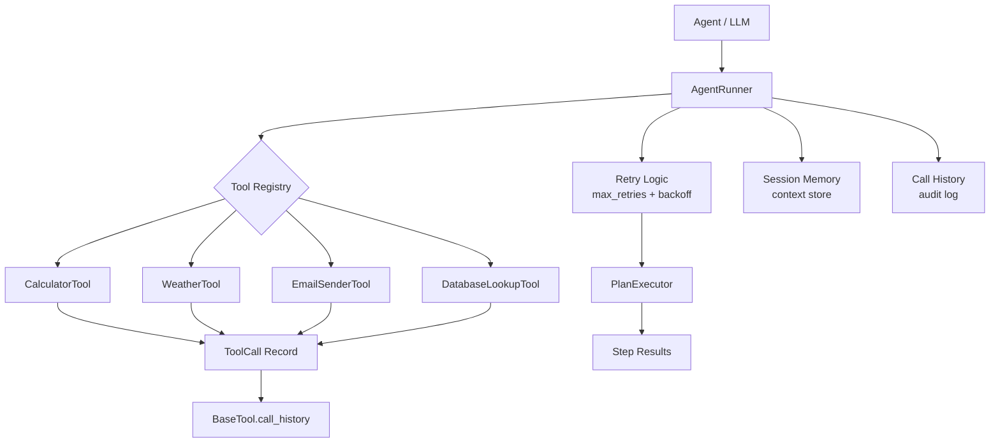

# Agent Tool Call Testing Framework


A **pytest-based testing framework** for validating AI agents that call external tools.
Built as a portfolio project to develop hands-on understanding of how to QA agentic
AI systems — one of the fastest-growing specialties in AI quality engineering.

---

## Problem This Solves

AI agents that call tools fail in ways traditional API testing misses entirely:

| Failure Mode | Example | This Framework Tests It |
|---|---|---|
| Wrong tool selected | Agent calls `weather` when it should call `database` | Tool routing assertions |
| Invalid parameters | Passes `"celsius"` where a number is expected | Parameter validation tests |
| No retry on transient failure | Network error causes silent drop | Retry behavior tests |
| Side effects on read operations | GET endpoint mutates state | Idempotency tests |
| State lost between turns | Agent forgets context from turn 1 | Memory/session tests |
| No failure path handling | Agent crashes on bad tool response | Negative path tests |

---

## Architecture



---

## Folder Structure

```
agent-tool-call-testing-framework/
├── .github/workflows/ci.yml
├── docs/
│   ├── interview-notes.md
│   └── resume-bullets.md
├── src/
│   ├── tools/
│   │   ├── base.py              # BaseTool, ToolCall dataclass, call history
│   │   ├── calculator.py        # Arithmetic tool (add/sub/mul/div/sqrt/power)
│   │   ├── weather.py           # Mock weather API by city
│   │   ├── email_sender.py      # Mock email with SMTP failure simulation
│   │   └── database.py          # In-memory table lookup with filters
│   └── agent/
│       ├── runner.py            # Tool dispatch, retry, session state
│       └── planner.py           # Multi-step plan executor
├── tests/
│   ├── conftest.py              # Shared fixtures
│   ├── test_calculator.py       # 14 tests
│   ├── test_weather.py          # 12 tests
│   ├── test_email.py            # 13 tests
│   ├── test_database.py         # 12 tests
│   ├── test_runner.py           # 14 tests (retry, session, routing)
│   └── test_planner.py          # 10 tests (multi-step, abort, continue)
├── .gitignore
├── pytest.ini
└── requirements.txt
```

---

## Setup

```bash
git clone https://github.com/guruambati/agent-tool-call-testing-framework.git
cd agent-tool-call-testing-framework
python -m venv venv
source venv/bin/activate
pip install -r requirements.txt
```

---

## Run Tests

```bash
# All tests
pytest

# With verbose output
pytest -v

# Single tool category
pytest tests/test_calculator.py -v

# With coverage
pytest --cov=src --cov-report=term-missing
```

---

## Quick Example

```python
from src.tools.calculator import CalculatorTool
from src.agent.runner import AgentRunner

# Direct tool usage
calc = CalculatorTool()
result = calc.run(operation="multiply", a=6, b=7)
print(result)  # {"result": 42, "operation": "multiply", ...}
print(calc.call_count)  # 1

# Via agent runner with retry
runner = AgentRunner(max_retries=3, retry_delay_s=0.1)
runner.start_session("demo-session")
runner.register_tool("calculator", calc.run)

output = runner.call_tool("calculator", {"operation": "add", "a": 10, "b": 5})
print(output)  # {"success": True, "result": {...}, "attempts": 1}
print(runner.state.tool_calls_made)  # full audit log
```

---

## Sample Test Output

```
tests/test_calculator.py::TestCalculator::test_addition                     PASSED
tests/test_calculator.py::TestCalculator::test_division_by_zero_raises      PASSED
tests/test_calculator.py::TestCalculator::test_unknown_operation_raises      PASSED
tests/test_runner.py::TestRetry::test_retries_on_connection_error           PASSED
tests/test_runner.py::TestRetry::test_non_retryable_not_retried             PASSED
tests/test_runner.py::TestSession::test_context_preserved_across_turns      PASSED
tests/test_planner.py::TestPlanner::test_plan_aborts_on_failure             PASSED
tests/test_planner.py::TestPlanner::test_continue_on_non_critical_failure   PASSED

========== 75 passed in 0.62s ==========
```

---

## Tech Stack

Python 3.11 · pytest · dataclasses · time · uuid · GitHub Actions CI

No external AI framework required — tools and agent runner are pure Python,
making every test fast, deterministic, and runnable in CI without API keys.

---

## Resume Bullets

See [`docs/resume-bullets.md`](docs/resume-bullets.md)

## Interview Notes

See [`docs/interview-notes.md`](docs/interview-notes.md)
